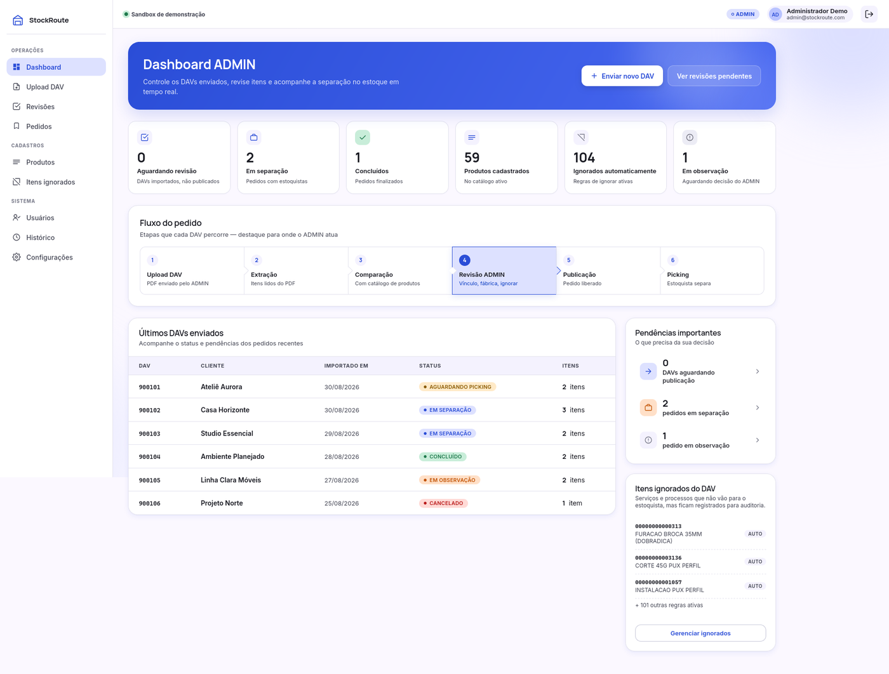
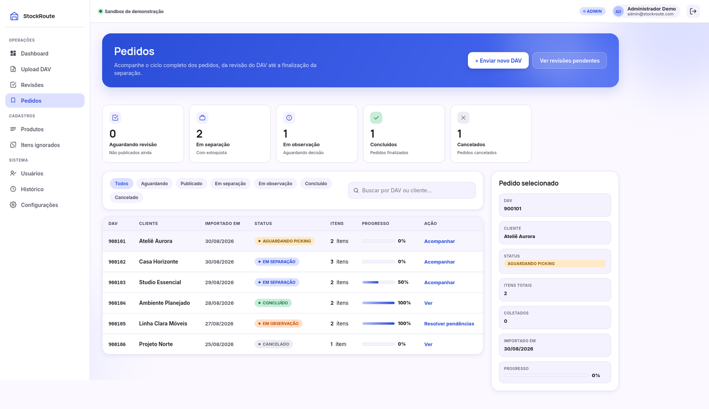
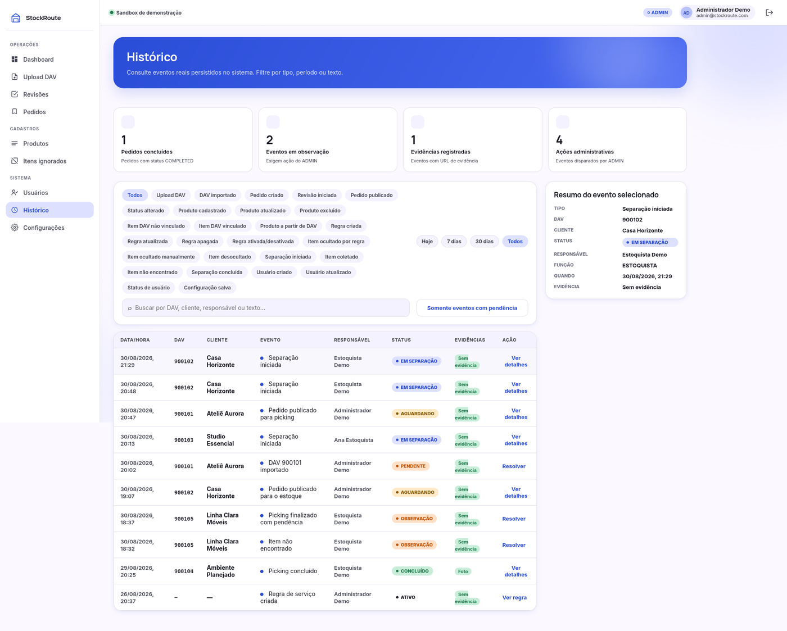

# StockRoute

StockRoute é um sistema web de gerenciamento de pedidos e separação de mercadorias (Picking) desenvolvido para digitalizar e otimizar operações de estoque e expedição.

O sistema foi projetado para substituir processos manuais baseados em PDFs impressos e marcações físicas, oferecendo rastreabilidade completa, validação operacional e controle em tempo real do fluxo de separação de pedidos.

## Demonstração ao vivo

**[stockroute.guilhermesc.me](https://stockroute.guilhermesc.me)**

Ambiente de demonstração com dados fictícios, aberto para navegação. Entre com um dos perfis abaixo:

| Perfil | E-mail | Senha | O que dá para fazer |
| --- | --- | --- | --- |
| ADMIN | `admin@stockroute.com` | `admin123` | Subir um DAV em PDF, revisar os itens extraídos, publicar o pedido e acompanhar o painel |
| ESTOQUISTA | `estoquista@stockroute.com` | `estoque123` | Separar um pedido, registrar foto de cada coleta e informar itens em falta |

Sugestão de percurso: entre como **ADMIN**, use *Baixar DAV de demonstração* na tela de Upload DAV e suba esse mesmo arquivo — ele foi montado para produzir um item vinculado, um ignorado por regra e um não vinculado, que é onde o fluxo de revisão fica visível. Publique o pedido, saia e entre como **ESTOQUISTA** para separá-lo.

A interface do estoquista é desenhada para o celular, mas funciona igualmente no desktop.

## Telas

### Dashboard do administrador



Estado da operação em números e a fila de DAVs recentes. O diagrama do meio marca em que etapa o administrador atua, e a coluna da direita concentra o que espera decisão: publicações pendentes, pedidos em separação e itens ignorados automaticamente por regra.

### Pedidos



Ciclo completo de cada pedido, da revisão do DAV até o fechamento. A barra de progresso mostra o avanço da separação em tempo real, e o painel lateral detalha o pedido selecionado sem tirar o administrador da lista.

### Histórico



Trilha de auditoria. Cada evento registra quem fez, quando, sobre qual pedido e com qual evidência — é aqui que a pergunta "esse item foi separado?" encontra resposta.

## Principais funcionalidades

- Autenticação JWT com controle de permissões
- Gestão de usuários (ADMIN e ESTOQUISTA)
- Upload e processamento automático de pedidos em PDF (DAV)
- Extração automática de itens via parsing de PDF
- Catálogo de produtos com imagens
- Fluxo completo de separação (Picking)
- Evidência fotográfica obrigatória para coleta de itens
- Controle de itens não encontrados
- Dashboard operacional em tempo real
- Histórico completo e rastreabilidade de pedidos
- Interface mobile-first para uso em galpão, adaptada também para desktop

## Tecnologias utilizadas

### Backend
- Node.js
- Express
- PostgreSQL
- pg (node-postgres)
- JWT
- bcrypt
- Multer
- pdf-parse

### Frontend
- React
- Vite
- CSS padrão

### Infraestrutura
- Docker
- pgAdmin
- PostgreSQL

O ambiente de demonstração roda em VPS própria, orquestrado por Coolify: backend e banco em containers, frontend servido por nginx e certificados TLS emitidos automaticamente.

## Objetivo do projeto

O principal objetivo do StockRoute é reduzir falhas operacionais em processos de separação de pedidos, garantindo que nenhum item seja ignorado durante a coleta e fornecendo rastreabilidade completa das operações logísticas.

### O problema

Em boa parte das operações de estoque, o pedido chega como um PDF que é impresso e entregue ao separador, que risca os itens à caneta enquanto percorre o galpão. Esse processo tem três buracos conhecidos:

- **Item esquecido não deixa rastro.** Quando o cliente reclama, não há como saber se o item foi separado e extraviado, ou se nunca foi coletado.
- **Falta de estoque vira conversa informal.** O separador avisa alguém, ou não avisa, e a informação não chega ao pedido.
- **Ninguém sabe o andamento.** Até o papel voltar, não existe estado: o pedido está "em algum lugar" entre a impressão e a expedição.

### A resposta do StockRoute

O sistema transforma o mesmo PDF em um fluxo com estado e evidência:

1. **Upload e extração** — o DAV em PDF é lido automaticamente e vira uma lista de itens vinculados ao catálogo de produtos.
2. **Revisão pelo administrador** — itens não reconhecidos e itens ocultados por regra ficam explícitos antes da publicação, em vez de aparecerem como surpresa no galpão.
3. **Separação com evidência** — o estoquista coleta item a item pelo celular, e cada coleta exige uma foto. Falta de estoque é registrada como um estado do item, com justificativa.
4. **Fechamento rastreável** — o pedido é concluído normalmente ou marcado com observação quando algo faltou, e todo o histórico fica consultável.

O resultado é que cada decisão operacional passa a ter autor, horário e evidência: a pergunta "esse item foi separado?" tem resposta.

## Arquitetura

O projeto segue uma arquitetura modular baseada em:
- Controllers
- Services
- Middlewares
- SQL puro com PostgreSQL
- Estrutura mobile-first
- API REST

## Como executar localmente

### Pré-requisitos

- Docker e Docker Compose
- Node.js 18+

### Passos

1. Clone o repositório:
   ```bash
   git clone https://github.com/Guilherme-AVVO/StockRoute.git
   cd StockRoute
   ```

2. Suba o banco de dados com Docker:
   ```bash
   docker-compose up -d
   ```

3. Configure e inicie o backend:
   ```bash
   cd backend
   npm install
   cp .env.example .env
   # Edite o arquivo .env com suas configurações
   npm run dev
   ```

4. Em outro terminal, configure e inicie o frontend:
   ```bash
   cd frontend
   npm install
   cp .env.example .env
   npm run dev
   ```

O backend estará disponível em `http://localhost:3000` e o frontend em `http://localhost:5173`.

## Sandbox local

O mesmo cenário da demonstração ao vivo roda na sua máquina. Com o PostgreSQL ativo e o `backend/.env` configurado:

```bash
cd backend
npm run demo:reset
```

O comando restaura a massa completa e pode ser repetido sempre que quiser voltar ao estado inicial — ele limpa os dados, apaga as fotos de coleta e roda as seeds de novo. Os perfis de acesso são os mesmos da tabela acima.

A especificação e os critérios de aceite estão em [`docs/SANDBOX_SPEC.md`](docs/SANDBOX_SPEC.md).


